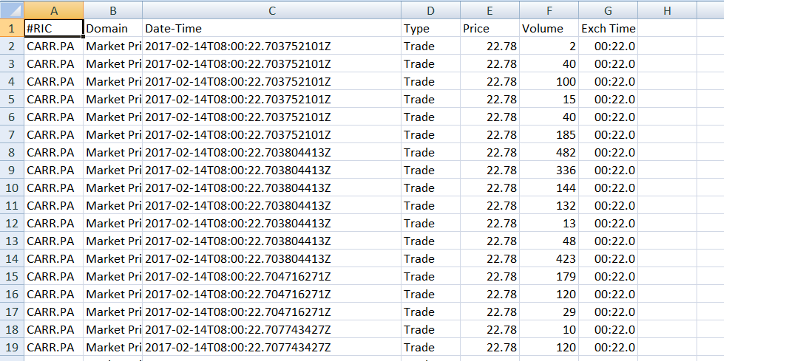

# Request TickHistorical Time and Sale using Python

## Introduction

[Thomson Reuters Tick History (TRTH)](https://developers.thomsonreuters.com/thomson-reuters-tick-history-trth) is an Internet-hosted product on the DataScope Select platform that provides SOAP-based and a REST API for unparalleled access to historical high frequency data across global asset classes dating to 1996.
However [a legacy SOAP-based API](https://developers.thomsonreuters.com/thomson-reuters-tick-history-trth/thomson-reuters-tick-history-trth-soap-api) is also available, and is scheduled to be sunset. Therefore client who still use SOAP-based API may need to migrate their application to use REST API instead.

One of the main use case for application that using TRTH API is to use the API requesting Time and Sales data for RICs. Basically the SOAP-based API, client can use SubmitRequest method to request Time and Sales data. In order to migrate to the new API client has to re-implement the application to use REST instead.

This example demonstrate how to use the new [REST API](https://developers.thomsonreuters.com/thomson-reuters-tick-history-trth/thomson-reuters-tick-history-trth-rest-api) to request Time and Sales data. The example also explains how to interact with the TRTH REST API by not using the [REST API Toolkit .Net SDK](https://developers.thomsonreuters.com/system/files/RESTAPIToolkit.zip?download_item_nid=9132&destination=node/8605/downloads%3Fdownload_item_nid%3D9132).
Instead it uses Python programming to demonstrate the API usages as Python script can works across OS and very easy to deal with HTTP request.
This example applies the steps provided in [TRTH REST API tutorial](https://developers.thomsonreuters.com/thomson-reuters-tick-history-trth/thomson-reuters-tick-history-trth-rest-api/learning) section which locates on [Developer Portal](https://developers.thomsonreuters.com/thomson-reuters-tick-history-trth/thomson-reuters-tick-history-trth-rest-api/) to implement the Python example.


## On Demand extraction request

Basically there are two kind of Tick History custom solution that are

* On Demand extractions- *all report attributes specified in single HTTP request that is submitted to run immediately*.
* Stored & scheduled- *The user define report attributes and it stored for future use, and schedule the report to run at set times or when triggered by events*.

This example uses only On Demand extraction to request Tick data/Tick History Time and Sales. However the raw data extraction workflow can apply to several types of On Demand historical data requests:
```text
    - Tick data
    - Market depth
    - Intraday bars
    - End of Day data
```
More details can be found at: [Tick History API User Guide](https://developers.thomsonreuters.com/thomson-reuters-tick-history-trth/thomson-reuters-tick-history-trth-rest-api/docs?content=11928&type=documentation_item)

This example uses the following steps to implement On Demand Extraction:
```text
1.Get Authentication Token from DSS server.

2.Retrieve available field list from the server (optional). We will skip this steps as the example will import or read reqeust payload from JSON file so we will specify required field list in JSON file instead.

3.Request historical data from the server, using an on demand extraction request. The request will be queued, then executed.

4.Check the request status. Poll it until the request is completed and get JobID.

5.Retrieve the data using the JobID from step 4 and write it to file.
```


**On Demand Tick Data extraction request payload**

In this request we need to:
* Specifying the instrument on which we are reporting.
* Specifying the type of report (Time and Sales)
* Specifying the Time and Sales report type’s Quote and Trade fields to include in the report.
* Specifying the report’s date range and other conditions.
* Submitting the report request to run immediately.

### 1.Authentication Request

To access Tick Historical data, we have to pass Token to the request header, therefore the first step is to get a new Token from DSS server.
This example will apply method to send Authentication request from [Programming without SDK Tutorial](https://developers.thomsonreuters.com/thomson-reuters-tick-history-trth/thomson-reuters-tick-history-trth-rest-api/learning?content=13561&type=learning_material_item) to send a reqeust.

### 2.Send On Demand Request

#### HTTP Request
*   **Endpoint URL:**
```
https://hosted.datascopeapi.reuters.com/RestApi/v1/Extractions/ExtractRaw
```
*   **Method**: POST

*   **Headers**:
```
Prefer: respond-async
Content-Type: application/json
Authorization: <Authorization Token>
```
*   **Body**:

    The body of the request must mention it is an extraction request. It contains several parts:

    * **The type of extraction**: as we want tick data we set a value of **TickHistoryTimeAndSalesExtractionRequest**.
    * **The list of field name**s: these were determined in the previous step of this tutorial.
    * **The list of instrument identifiers**, each one with its type. Below sample, we define one instrument using a RIC.
    * **The conditions**: they include the date range for the request.

We can find available parameters from [**Thomson Reuters Tick History 10.8 REST API Use Case Reference v1.0**](https://developers.thomsonreuters.com/sites/default/files/Thomson%20Reuters%20Tick%20History%2011.0%20REST%20API%20Use%20Cases%20Reference%20v1.0.pdf).

*   Sample JSON HTTP request payload
```
{
  "ExtractionRequest": {
    "@odata.type": "#ThomsonReuters.Dss.Api.Extractions.ExtractionRequests.TickHistoryTimeAndSalesExtractionRequest",
    "ContentFieldNames": [
      "Trade - Price",
      "Trade - Volume",
      "Trade - Exchange Time",
    ],
    "IdentifierList": {
      "@odata.type": "#ThomsonReuters.Dss.Api.Extractions.ExtractionRequests.InstrumentIdentifierList",
      "InstrumentIdentifiers": [{
        "Identifier": "CARR.PA",
        "IdentifierType": "Ric"
      }]
    },
    "Condition": {
      "MessageTimeStampIn": "GmtUtc",
      "ApplyCorrectionsAndCancellations": false,
      "ReportDateRangeType": "Range",
      "QueryStartDate": "2016-09-29T00:00:00.000Z",
      "QueryEndDate": "2016-09-29T12:00:00.000Z",
      "DisplaySourceRIC": true
    }
  }
}
```

#### HTTP response

* After we send HTTP request message to the DSS server, the application will receive response message back and we expected to receive HTTP response status code of 202 Accepted, and the header will contain a location URL.
The next step is to check the request status by polling the location URL regularly until it returns a HTTP response status code 200 OK.

* If the request is for a small amount of data, the response could have an HTTP status of 200 OK, and the body will contain a jobId and Notes. According to [DATASCOPE SELECT document](https://developers.thomsonreuters.com/datascope-select-dss/datascope-select-rest-api/docs?content=6091&type=documentation_item), the Notes provides information about the extraction execution, including processing statistics, embargo delays, suppressed items and warnings.

* We skip the step where we check the request status, and go directly to the last step, which is to retrieve the data using the jobId.
  Other HTTP status codes can be encountered, follow [this link](https://hosted.datascopeapi.reuters.com/RestApi.Help/Home/StatusCodes) for a full list with detailed explanations.
  It is strongly recommended that the code handle all possible status codes.

### 3. Check request status

#### HTTP request

Skip this step if the previous step returned an HTTP status of 200 OK.

If the previous step returned an HTTP status of 202 Accepted, this step must be executed, and repeated in a polling loop until it returns an HTTP status of 200 OK.

* **URL**:

  This is the location URL, taken from the 202 response header received in the previous step.
```
https://hosted.datascopeapi.reuters.com/RestApi/v1/Extractions/ExtractRawResult(ExtractionId='0x058dcda3c29b5841')
```

*   **Method**:GET
*   **Headers**:
```
Prefer: respond-async
Content-Type: application/json
Authorization: <Authorization Token>
```

#### HTTP response
If we receive an HTTP status 202 Accepted response (the same as in the previous step), it means the request has not yet completed. We must wait a bit and check the request status again.
If we receive an HTTP status 200 OK response, the body will contain a jobId and Notes and we can go to the last step to retrieve the data using the jobId.

### 4.Retrieve data
#### HTTP request

It is mandatory to have received a 200 OK response with a JobID from a previous step before proceeding with this last step.

*   **URL**:
Note the jobId value (0x058dcda3c29b5841) used as parameter in the URL:
```
https://hosted.datascopeapi.reuters.com/RestApi/v1/Extractions/RawExtractionResults('0x058dcda3c29b5841')/$value
```
*   **Method**: GET
*   **Headers**:
*   **Prefer**: respond-async
*   **Content-Type**: Accept-Encoding: gzip, deflate
*   **Authorization**: <Authorization Token>

#### HTTP response

We should get a response of this type:
```
Status:200 OK
```
Relevant headers:
```
Content-Encoding: gzip
Content-Type: text/plain
```
Body:

```text
Here is the beginning of the response content, which for the above query contains more than 3000 lines:

#RIC,Domain,Date-Time,Type,Price,Volume,Exch Time
CARR.PA,Market Price,2016-09-29T07:00:11.672415651Z,Trade,23.25,63,07:00:11.000000000
CARR.PA,Market Price,2016-09-29T07:00:11.672415651Z,Trade,23.25,64,07:00:11.000000000
CARR.PA,Market Price,2016-09-29T07:00:11.672415651Z,Trade,23.25,27,07:00:11.000000000

Here is the end of the response content:

CARR.PA,Market Price,2016-09-29T11:59:46.352157769Z,Trade,23.25,8,11:59:46.000000000
CARR.PA,Market Price,2016-09-29T11:59:46.352798946Z,Trade,23.25,207,11:59:46.000000000
CARR.PA,Market Price,2016-09-29T11:59:46.552806988Z,Trade,23.245,182,11:59:46.000000000
```


### Python Implementation
#### Prerequisite

* To run the example we should have python 2.7 or 3.6 installed on the OS. We can download python installer from below link. Basically we can open the example with any text editor.
  For a free Python IDE, we recommend PyCharm Community edition or Visual Studio Code.
```text
https://www.python.org
```
* In order to access Tick Historical end point, we must have the DSS account with permission to access Tick Historical’s REST API. Please contact Thomson Reuters Account representative if you need the permission.

* To use HTTP request and get responses back, This example use Python requests module. If you don’t have requests module installed in your library, you can install it by using pip install.

> pip install requests

#### **Step1**: Get Authentication Token from DSS server.

Ask user to input DSS username and password and then send authentication request to DSS server to get a new Authentication Token.

```python
def RequestNewToken(username="",password=""):
    _AuthenURL = "https://hosted.datascopeapi.reuters.com/RestApi/v1/Authentication/RequestToken"
    _header= {}
    _header['Prefer']='respond-async'
    _header['Content-Type']='application/json; odata.metadata=minimal'
    _data={'Credentials':{
        'Password':password,
        'Username':username
        }
    }

    print("Send Login request")
    resp=post(_AuthenURL,json=_data,headers=_header)

    if resp.status_code!=200:
        message="Authentication Error Status Code: "+ str(resp.status_code) +" Message:"+resp.text
        raise PermissionError(dumps(message))

    return loads(resp.text)['value']
```


#### **Step2**: Send On Demand Extraction request.

We have to import request and json module in the example. The json module is required to manage JSON data in the HTTP request and response.

```python
from json import dumps, loads, load
from requests import post
from requests import get
```
Request historical data from the server, using an on demand extraction. We need to pass json_payload which is request body to the server.

```python
#Function ExtractRAW
def ExtractRaw(token,json_payload):
    _extractRawURL="https://hosted.datascopeapi.reuters.com/RestApi/v1/Extractions/ExtractRaw"
    #Setup Request Header
    _header={}
    _header['Prefer']='respond-async, wait=5'
    _header['Content-Type']='application/json; odata.metadata=minimal'
    _header['Accept-Charset']='UTF-8'
    _header['Authorization']='Token'+token

    #Send HTTP post message to DSS server using extract raw URL

    resp=post(_extractRawURL,data=None,json=json_payload,headers=_header)
```
To pass json_payload to HTTP post, we read the JSON request message from JSON file.
```python
#Read the HTTP request body from JSON file. So we can change the request in JSON file instead.
queryString = {}
with open(_jsonFileName, "r") as filehandle:
    queryString=load(filehandle)

#print(queryString)
ExtractRaw(_token,queryString)
```

#### **Step3**: Polling request status from the server.
We have to check the request status. This example uses a simple pooling loop to check status until it get status code 200 (Completed). Then we can get jobID from response body.
```python

        #Raise exception with error message if the returned status is not 202 (Accepted) or 200 (Ok)
        if resp.status_code!=200:
            if resp.status_code!=202:
                message="Error: Status Code:"+str(resp.status_code)+" Message:"+resp.text
                raise Exception(message)

            #Get location from header
            _location=resp.headers['Location']
            print("Get Status from "+str(_location))
            _jobID=""

            #pooling loop to check request status every 2 sec.
            while True:
                resp=get(_location,headers=_header)
                _pollstatus = int(resp.status_code)

                if _pollstatus==200:
                    break
                else:
                    print("Status:"+str(resp.headers['Status']))
                sleep(_retryInterval) #wait 2 sec and re-request the status to check if it already completed

        # Get the jobID from HTTP response
        json_resp = loads(resp.text)
        _jobID = json_resp.get('JobId')
        print("Status is completed the JobID is "+ str(_jobID)+ "\n")

        # Check if the response contains Notes and print it.
        if len(json_resp.get('Notes')) > 0:
            print("Notes:\n======================================")
            for var in json_resp.get('Notes'):
                print(var)
            print("======================================\n")
```


#### **Step4**: Retrieve the data using the JobID and Write to file.
We use reqeusts.get to retrieve result and then write content of the response message to file.
```python
# Request should be completed then Get the result by passing jobID to RAWExtractionResults URL
        _getResultURL=str("https://hosted.datascopeapi.reuters.com/RestApi/v1/Extractions/RawExtractionResults(\'"+_jobID+"\')/$value")
        print("Retrieve result from "+_getResultURL)
        resp=get(_getResultURL,headers=_header,stream=True)

        #Write Output to file.
        outputfilepath = str(_outputFilePath + _outputFileName + str(os.getpid()) + '.csv.gz')
        if resp.status_code==200:
            with open(outputfilepath, 'wb') as f:
                f.write(resp.raw.read())

        print("Write output to "+outputfilepath+" completed")
```

There are four parameters that user can configure in this example.

1. The output file path (_outputFilePath) ,
2. File name used to write output file(_outputFileName),
3. The _retryInterVal is the time that the example will wait and check for the status code of the request.
4. JSON file name that the example used to import the JSON request body and pass it to the HTTP request message. See sample JSON data from section **Sample JSON HTTP request payload**.

```python
_outputFilePath="./"
_outputFileName="TestOutput"
_retryInterval=3
_jsonFileName="TickHistoricalRequest.json"
```

#### How to run the example
This example requires JSON file "TickHistoricalRequest.json" which contains JSON payload for HTTP request.
We can modify JSON file to change request body.

**Command line**
>python.exe TickHistoryTimesAndSalesRequest.py

Then we should see the following console output
```
>python TickHistoryTimesAndSalesRequest.py

__main__
Login to DSS Server
Enter DSS Username:9009xxx
Enter DSS Password:
Send Login request
Token=_hGQGfJaEVEfqtCKfs7gz3qCdcCw1kvpixFyLWwIlx3s8rJ4o6OxfRBDdiALH9RlmrsXNW74-Dn2QbPk4fz5EYPmvM9i0oBmrkYhJ2Anx6RsQhT-oOk7PjtPnC6MIe-GlmTkoNB_AIYOnZpINgcH1WswF7tBoIZf3WRDS_mdryN75s58jhmRUDXcYLziMzvsSV
_DbodOztLnPAIxHvda68z-JScz9M1KBYE8mGacxW0cnhY3tgrSmTzjLOM2KUltNr-dLXbuIWUN2fljQVC8MUTdwOgGy64DDb999U1GLopQ

Status Code=202
Get Status from https://hosted.datascopeapi.reuters.com/RestApi/v1/Extractions/ExtractRawResult(ExtractionId='0x05bf56b371cb2f86')
Status:InProgress
Status:InProgress
Status:InProgress
Status:InProgress
Status is completed the JobID is 0x05bf56b371cb2f86

Notes:
======================================
Extraction Services Version 11.0.36705 (cbb5015f7377), Built May  2 2017 18:05:54
User ID: 9009975
Extraction ID: 2000000000678648
Schedule: 0x05bf56b371cb2f86 (ID = 0x0000000000000000)
Input List (1 items):  (ID = 0x05bf56b371cb2f86) Created: 07-06-2017 13:58:25 Last Modified: 07-06-2017 13:58:25
Report Template (3 fields): _OnD_0x05bf56b371cb2f86 (ID = 0x05bf56b3c5ab2f86) Created: 07-06-2017 13:57:49 Last Modified: 07-06-2017 13:57:49
Schedule dispatched via message queue (0x05bf56b371cb2f86), Data source identifier (0DEC0E52146A4BFABAB5C19C5C50CD0C)
Schedule Time: 07-06-2017 13:57:50
Processing started at 07-06-2017 13:57:51
Processing completed successfully at 07-06-2017 13:58:25
Extraction finished at 07-06-2017 06:58:25 UTC, with servers: tm04n01
Instrument <RIC,SCB.BK> expanded to 1 RIC: SCB.BK.
Quota Message: INFO: Tick History Cash Quota Count Before Extraction: 425; Instruments Extracted: 1; Tick History Cash Quota Count After Extraction: 425, 85% of Limit; Tick History Cash Quota Limit: 5
00
Manifest: #RIC,Domain,Start,End,Status,Count
Manifest: SCB.BK,Market Price,2017-05-31T02:57:36.992896230Z,2017-05-31T09:44:01.817274443Z,Active,2274

======================================

Retrieve result from https://hosted.datascopeapi.reuters.com/RestApi/v1/Extractions/RawExtractionResults('0x05bf56b371cb2f86')/$value
Write output to ./TestOutput6856.csv.gz completed

```

Open .csv output in Excel to see Time And Sale data




The sources codes can be downloaded from [Link](./TickHistoricalOnDemandTimeAndSales.zip)

